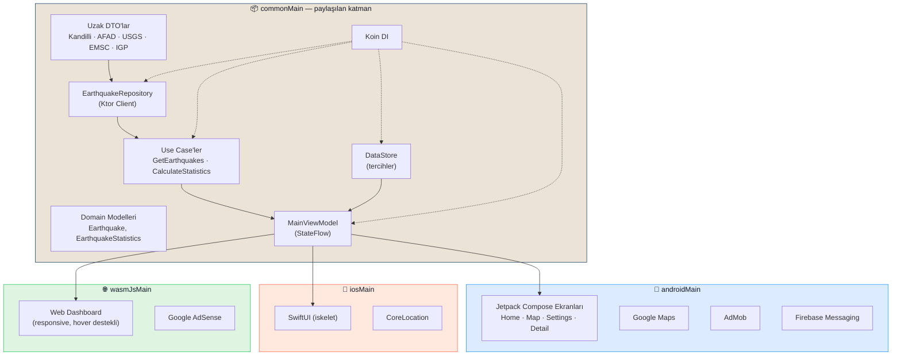

<div align="center">


# 🌍 Anlık Depremler

### Türkiye ve dünya genelinde gerçek zamanlı deprem takibi — Android, iOS ve Web'de tek kod tabanından.

[](https://kotlinlang.org)
[](https://www.jetbrains.com/lp/compose-multiplatform/)
[](#-hakkında)

[🌐 Canlı Web Uygulaması](https://anlikdeprem.web.app) · [🐛 Hata Bildir](https://github.com/ferdidrgn/AnlikDepremlerKMP/issues) · [✨ Özellik İste](https://github.com/ferdidrgn/AnlikDepremlerKMP/issues)

</div>

---

## 📖 Hakkında

**Anlık Depremler**, Kandilli Rasathanesi, AFAD, USGS, EMSC ve dünya genelindeki (IGP) sismik
veri kaynaklarını tek bir uygulamada birleştiren, gerçek zamanlı bir deprem takip
uygulamasıdır. Kotlin Multiplatform üzerine inşa edilmiştir: veri katmanı, iş mantığı ve
durum yönetimi (ViewModel) **tek bir ortak Kotlin kod tabanında** yazılır; Android, iOS ve
Web (Kotlin/Wasm) hedeflerinin her biri kendi arayüzünü — ama aynı canlı veriyi — sunar.

<div align="center">

|  | Android | iOS | Web |
|---|:---:|:---:|:---:|
| **Durum** | ✅ Yayında | 🚧 Geliştiriliyor | ✅ Yayında |
| **Arayüz** | Jetpack Compose (tam) | SwiftUI (iskelet) | Compose Multiplatform (dashboard) |
| **Canlı veri** | ✅ | ✅ | ✅ |

</div>

---

## ✨ Özellikler

### 🔴 Canlı Deprem Verisi
- 🇹🇷 **Kandilli**, **AFAD**, **Türkiye Karışık** ve 🌍 **USGS**, **EMSC**, **Dünya Genel (IGP)**
  kaynakları arasında anlık geçiş
- 📊 Günlük / haftalık / aylık deprem istatistikleri, ortalama & maksimum büyüklük, en aktif bölge
- 📈 Büyüklük dağılım grafiği (canlı animasyonlu çubuklar)
- ⏱️ Zaman filtreleri: son 1 saat, 6 saat, 24 saat, 7 gün, 30 gün

### 📍 Konum Farkındalığı
- GPS ile otomatik şehir tespiti ve o bölgedeki depremleri listeleme
- **Yakın deprem uyarısı**: 100 km yakınında 4.0+ büyüklüğünde bir deprem olduğunda anında kart
  uyarısı + kaydedilen acil durum telefon numarasına hızlı erişim
- 🗺️ İnteraktif Google Haritalar entegrasyonu, büyüklüğe göre renklendirilmiş işaretçiler

### 🔔 Bildirim & Paylaşım
- Firebase Cloud Messaging ile anlık deprem bildirimleri
- **Derin bağlantılar (deep links)**: paylaşılan bir deprem/harita linki — uygulama telefonda
  yüklüyse doğrudan ilgili ekranı açar, yüklü değilse otomatik olarak web sitesine yönlendirir
  (Android App Links, `assetlinks.json` ile doğrulanmış)

### 🎨 Kişiselleştirme
- 🌗 3 tema modu: **Krem (Açık)**, **Sistem**, **Koyu Gece**
- 🌐 **14 dil** desteği, uygulama içinden anında dil değişimi (yeniden başlatma gerekmez)
- Android 12+ için özel tasarlanmış, markalı sistem açılış (splash) ekranı

### 📚 Ek İçerik
- 🏛️ Geçmiş büyük depremler arşivi (Kahramanmaraş 2023, İzmir 2020, Van 2011, Gölcük 1999...)
- ✅ Acil durum çantası kontrol listesi ve hazırlık ipuçları
- 📄 Gizlilik politikası ve kullanım şartları uygulama içinde

### 💰 Gelir Modeli
- AdMob banner & native reklamlar (mobil)
- Google AdSense (web)
- Google Play Billing ile isteğe bağlı "kahve ısmarla" bağışı

---

## 🖼️ Ekran Görüntüleri

> Gerçek cihaz/simülatör ekran görüntüleri henüz eklenmedi — katkıda bulunmak isterseniz
> `docs/screenshots/` altına Android, iOS ve Web ekran görüntülerinizi ekleyip bir PR açabilirsiniz. 🙌

<div align="center">

</div>

---

## 🏗️ Mimari

Proje, [Kotlin Multiplatform](https://kotlinlang.org/docs/multiplatform.html) ile **tek
sorumluluk** ilkesine göre katmanlara ayrılmıştır: veri/iş mantığı `commonMain`'de paylaşılır,
her platform yalnızca kendi arayüz katmanını yazar.



### Klasör yapısı

```
composeApp/
└── src/
    ├── commonMain/     # Modeller, DTO'lar, mapper, repository (Ktor),
    │                   # use case'ler, DataStore, Koin DI, MainViewModel
    ├── androidMain/     # Jetpack Compose UI, navigation, Maps, AdMob, Firebase
    ├── iosMain/         # CoreLocation, Koin platform modülü
    └── wasmJsMain/      # Web dashboard, tarayıcı API'leri (localStorage vb.)
iosApp/                  # Xcode projesine eklenecek Swift kaynakları
```

---

## 🛠️ Teknoloji Yığını

| Katman | Teknoloji |
|---|---|
| **Dil** | [Kotlin](https://kotlinlang.org) (Multiplatform) |
| **UI** | [Compose Multiplatform](https://www.jetbrains.com/lp/compose-multiplatform/) · Material 3 |
| **Ağ** | [Ktor Client](https://ktor.io/) + kotlinx.serialization |
| **DI** | [Koin](https://insert-koin.io/) |
| **Yerel Depolama** | AndroidX DataStore Preferences (Multiplatform) |
| **Harita** | Google Maps Compose |
| **Bildirim & Analitik** | Firebase (Cloud Messaging, Firestore, Analytics, Crashlytics) |
| **Reklam** | Google AdMob (mobil) · Google AdSense (web) |
| **Ödeme** | Google Play Billing |
| **Hosting (Web)** | Firebase Hosting |
| **Web Hedefi** | Kotlin/Wasm + `ComposeViewport` |

---

## 🌐 Desteklenen Diller

🇹🇷 Türkçe · 🇬🇧 English · 🇩🇪 Deutsch · 🇪🇸 Español · 🇮🇹 Italiano · 🇷🇺 Русский · 🇺🇦 Українська ·
🇬🇷 Ελληνικά · 🇰🇬 Кыргызча · 🇺🇿 Oʻzbekcha · 🇸🇦 العربية · 🇰🇷 한국어 · 🇯🇵 日本語 · 🇨🇳 中文

---

## 🚀 Başlarken

### Gereksinimler
- **Android**: Android Studio (Koala+), JDK 17
- **iOS**: Xcode 15+, Mac (bkz. [`iosApp/README.md`](iosApp/README.md))
- **Web**: JDK 17, Node.js (Kotlin/Wasm toolchain otomatik iner)

### Kurulum

```bash
git clone https://github.com/ferdidrgn/AnlikDepremlerKMP.git
cd AnlikDepremlerKMP
```

`local.properties` dosyasına kendi API anahtarlarınızı ekleyin (Google Maps, AdMob) —
`google-services.json` dosyasını da `composeApp/` altına yerleştirmeniz gerekir (Firebase Console).

### Çalıştırma

```bash
# Android
./gradlew :composeApp:assembleDebug

# Web (tarayıcıda geliştirme sunucusu)
./gradlew :composeApp:wasmJsBrowserDevelopmentRun

# Web (production derleme + Firebase Hosting'e deploy)
./gradlew :composeApp:wasmJsBrowserDistribution
firebase deploy --only hosting
```

iOS için Xcode kurulumu adım adım [`iosApp/README.md`](iosApp/README.md) içinde.

---

## 📄 Lisans

Bu proje şu an özel (kapalı kaynak) bir uygulamadır — tüm hakları saklıdır. Açık kaynak
yapmak isterseniz bir `LICENSE` dosyası ekleyip bu bölümü güncelleyebilirsiniz.

---

<div align="center">

Türkiye'de yaşayan herkes için ❤️ ile geliştirildi.

**[⬆ Başa dön](#-anlık-depremler)**

</div>
